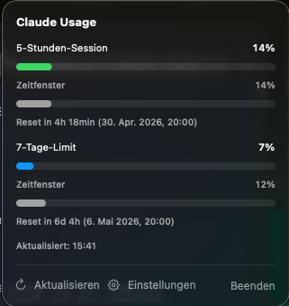

# ClaudeStatus 📊

<p align="center">
  
</p>

A native macOS menu bar app that shows your current Claude.ai subscription usage at a glance:

- ⏱️ 5-hour rolling session in percent (with traffic-light color in the menu bar)
- 📅 7-day weekly limit
- 🧠 7-day Opus limit (only shown when used)
- ⏳ Reset countdown for each limit

## ✨ Features

- 🍏 100% native SwiftUI, no Electron, no web view
- 🪶 Tiny footprint, no Dock icon, no main window
- 🔒 `sessionKey` stored securely in the macOS Keychain
- 🚦 Traffic-light icon: green < 60%, yellow < 85%, red ≥ 85%
- 🔄 Refreshes every 60 seconds
- 🎛️ Six menu bar display modes — usage only or usage paired with elapsed-time progress, for the 5h window, the weekly window, or both

## 📋 Requirements

- 🖥️ macOS 14 Sonoma or newer
- 🛠️ Xcode Command Line Tools (`xcode-select --install`)
- 💳 An active Claude.ai Pro or Max subscription

## 📦 Download a prebuilt release

Grab the latest `.zip` from the [Releases page](../../releases), unzip, drag `ClaudeStatus.app` into `/Applications`, double-click. Done. ✅

## 🚀 Build and install

```bash
cd ClaudeStatus
./build-app.sh
mv build/ClaudeStatus.app /Applications/
open /Applications/ClaudeStatus.app
```

The script builds a release version and packages it as a `.app` bundle with `LSUIElement = true`, so no Dock icon shows up. The ad-hoc signature is sufficient for local personal use.

On first launch, macOS asks for permission once because the app is not notarized. If Gatekeeper blocks it: `System Settings → Privacy & Security → "Open Anyway"`. 🔓

## 🔑 Set the sessionKey

On first launch, the menu bar icon shows a crossed-out key. Click it, then **Settings**, then paste the `sessionKey` from claude.ai.

How to get the `sessionKey`:

1. 🌐 Open https://claude.ai in your browser, make sure you are logged in.
2. 🛠️ Open DevTools (`Cmd + Option + I`).
3. 📂 Tab **Application** (Chrome) or **Storage** (Safari) → **Cookies** → `https://claude.ai`.
4. 🔍 Find the `sessionKey` entry, copy its **Value** (a long string starting with `sk-ant-sid01-…`).
5. 📥 Paste it into the settings field, save.

The cookie is stored in the macOS Keychain. It typically lives for a few weeks. When the icon shows a warning triangle ⚠️, it expired — repeat the steps above.

## 🎛️ Menu bar display modes

Open **Settings → Menüleisten-Anzeige** to pick what the menu bar shows. `x` is token usage, `y` is the elapsed-time progress within the same window.

| Mode | Example |
|---|---|
| 5h: x% _(default)_ | `45%` |
| 5h: x%/y% | `45%/67%` |
| Woche: x% | `30%` |
| Woche: x%/y% | `30%/12%` |
| 5h + Woche (x% \| x%) | `45% \| 30%` |
| 5h + Woche (x%/y% \| x%/y%) | `45%/67% \| 30%/12%` |

The choice is persisted across restarts.

## 🌅 Autostart at login

Until a dedicated settings toggle exists: in `System Settings → General → Login Items → +` add `ClaudeStatus.app`.

## 🚫 What this app does NOT do

- ❌ No EUR cost estimation (the data source does not return token counts, any estimate would be too unreliable)
- ❌ No access to Claude Code CLI data or the Anthropic Console
- ❌ No history, no charts, no push notifications

## ⚠️ Notes

The endpoint used (`https://claude.ai/api/organizations/{org}/usage`) is **unofficial**. Anthropic may change it at any time. The app parses defensively and shows an error if the schema breaks.

Treat the `sessionKey` like a password 🔐. Anyone who has it is logged in to claude.ai as you. The app stores it locally in the Keychain only and only sends it in the `Cookie` header of requests to `claude.ai`.

## 🗂️ Project structure

```
ClaudeStatus/
├── Package.swift
├── build-app.sh                  # builds .app bundle with LSUIElement
└── Sources/ClaudeStatus/
    ├── ClaudeStatusApp.swift     # @main, MenuBarExtra
    ├── Models/UsageSnapshot.swift
    ├── Services/
    │   ├── ClaudeAPIClient.swift # URLSession wrapper
    │   └── KeychainStore.swift   # cookie & org id in Keychain
    ├── State/
    │   ├── UsageStore.swift           # ObservableObject, 60s polling
    │   └── MenuBarDisplayMode.swift   # enum for the menu bar display picker
    └── Views/
        ├── PopoverView.swift
        └── SettingsView.swift
```

## 📜 License

MIT — use it, fork it, break it, fix it. 🛠️
